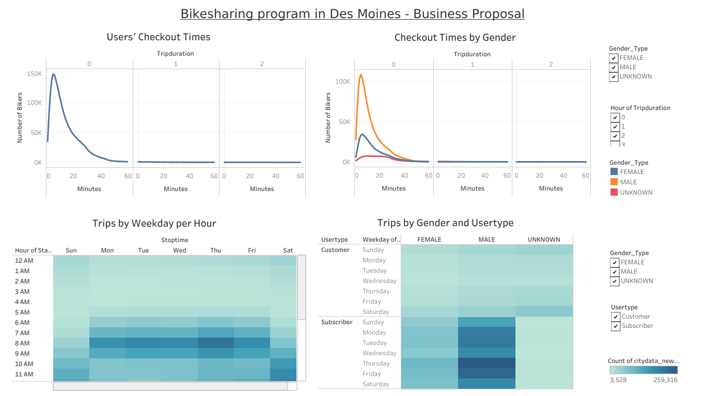

# bikesharing
Data visualization using Tableau 
# **Business Case Proposal for Bike-Sharing Program**
## ***Project Overview:***
The intent of the project to propose the necessasity of a Bike-Sharing program in the city of Des Moines. The business proposal is based on the NYC City Data taken during the month of August in 2019. The data was downloaded from the [Citi NYC Data](https://ride.citibikenyc.com/system-data). Pandas was used to clean/modify data and Tableau was used to provide visualization. 

## ***Project Results:***
After performing the analysis from the data provided, following results were observed. 
* Data source: [Citi NYC Data](https://ride.citibikenyc.com/system-data) 
* Software: Jupyter Notebook and Tableau 
* Project Story can be found here [Business Proposal](https://public.tableau.com/views/Rideshare_BusinessCase/Story1?:language=en-US&publish=yes&:display_count=n&:origin=viz_share_link)
* Dashboard from project Summary can be found below:
 
[Story](Rideshare_BusinessCase.pptx)

The Story provides the detailed analysis of the program by various parameters. 

## ***Summary:***
The following conclusions are made from the analysis, 
* From the data, an increased male riders were Male compared to the females. 
* The number of bikers were significantly higher during the peak hours (7.00-9.00 AM and 5.00-7.00 PM).
* The demand were see also during the weekends and this could possibly be due to the increased tourist destinations around the area. 
* The next steps are to analyse the cost per trip spend, total investments made to provide a complete justification for the program. 

